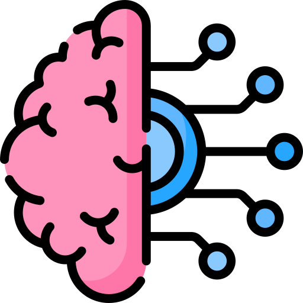

<h1 align="center"> Aarya Pathak | Aspiring App Developer & Machine Learning Engineer 🖥️</h1>

  

  
  
  
  

## 👨‍💻 About Me

Hello! I'm a passionate sophomore pursuing Computer Science at **Kathmandu University, Nepal**, with a deep interest in **mobile app development using Flutter** and **machine learning**. I'm enthusiastic about building innovative applications and harnessing the power of AI for intelligent solutions.

- 🎓 Currently pursuing a degree in Computer Science
- 📱 Aspiring mobile app developer focused on Flutter and Dart
- 🤖 Fascinated by machine learning models and their real-world applications
- 🌱 Constantly learning and expanding my skillset in app development and AI/ML frameworks
- 🤝 Eager to collaborate on exciting projects in healthcare and education, leveraging AI and mobile technologies
- 💼 Actively seeking internships and entry-level opportunities in app development and machine learning
- ⚡ **Fun fact**: When I’m not coding, you can find me playing cricket or diving into psycholinguistics to explore how the human brain processes language.

# 💻 Tech Stack:
               
# 📊 GitHub Stats:
 
 

### ✍️ Random Dev Quote

### 🔝 Top Contributed Repo

---

<!-- Proudly created with GPRM ( https://gprm.itsvg.in ) -->
